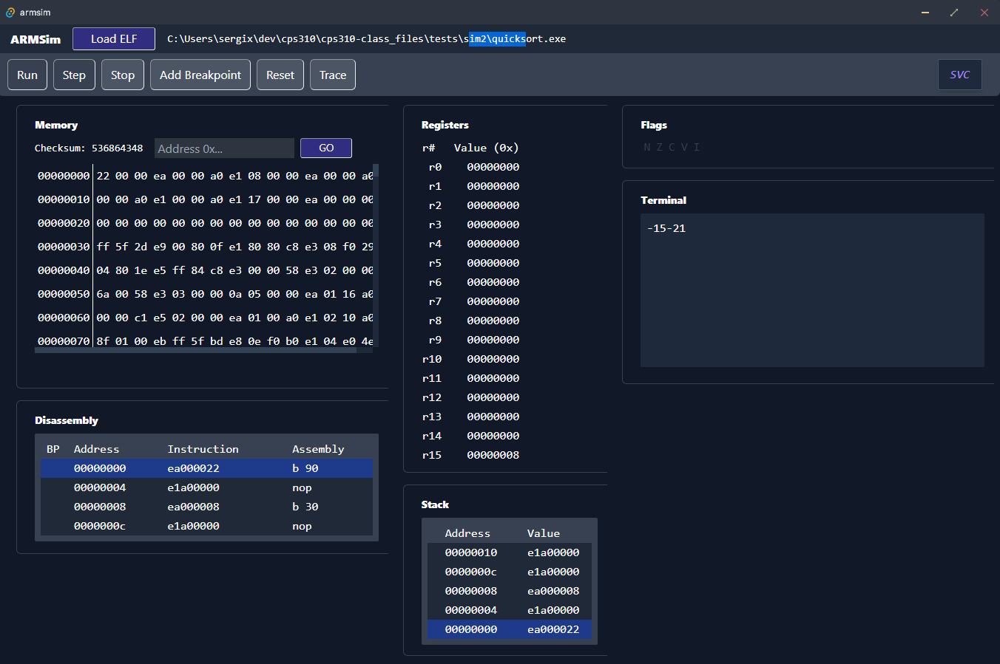

# README

**Name:** Peyton McGinnis  
**Course:** CpS 310  
**Submission date:** 27 November 2022  
**Hours spent this phase:** 37

## Overview

ARMSim is a GUI debugger for ELF-binary applications compiled for ARM32. This application can load an ELF binary, disassemble the binary, and show the flags, memory, and stack as the application runs with inline run/step debugging.

## Features

- ELF loader displays correct checksums for valid ELF files
- Simulated RAM with checksums
- `--mem`, `--exec`, and `<elf-file>` command line options are supported and validated
- Register viewer (r0..15)
- Flags display
- Stacks panel
- Internal CPU simulator
- Automatic execution through `--exec` option
- Scrollable memory grid
  - Navigates to any given address and properly formats the table
- Comprehensive unit tests
  - All `lib::memory` logic
  - A few for disassembly, decoding, and `instruction` building
- Multithreaded debugger controls -- Run, Step, Stop, Reset
- All hotkeys implemented
- Optional trace logs output to `trace.log` in local directory
- Logging framework implemented using `tauri-plugin-log`, however enabling/disabling logging to shell in Debug mode or changing the default logfile destination are currently not supported. (More information in the Configuration section)
- Polished GUI
- Resizable window
- Breakpoints
  - Add and toggle breakpoints in the disassembly window
- Quality draft and detailed design
- All required instructions implemented
- Disassembly table with accurate assembly for all instructions
- Correct trace logs for all tests, with trace logging for all system modes
- Interrupt processing
- All processor modes: `SYS`, `SVC`, `IRQ`
- Banked register swapping and CPU modes for SYS, SVC, and IRQ modes
- Memory-mapped keyboard and display device I/O handling
- Terminal window interaction with real-time output and interactive interrupt prompts
  - SWI instructions
  - Memory-mapped keyboard and display devices
- Processor mode notes in toolbar
- SWI I/O handlers (putchar, halt, readline) with processor mode switching

## Prerequisites

#### OS Platforms

Windows 10/11, macOS, Debian, Arch, Fedora, openSUSE

#### Software

- [yarn 1.22.^](https://classic.yarnpkg.com/en/docs/install)
- [Rust + cargo](https://www.rust-lang.org/)
- [Tauri CLI](https://tauri.app/v1/guides/getting-started/setup/html-css-js#create-the-rust-project)

#### Windows-only
- [Build Tools for Visual Studio 2022](https://visualstudio.microsoft.com/visual-cpp-build-tools/)

#### macOS-only

- [CLang and macOS development dependencies](https://tauri.app/v1/guides/getting-started/prerequisites#1-clang-and-macos-development-dependencies)

#### Linux-only

- [C compiler and WebKit2GTK](https://tauri.app/v1/guides/getting-started/prerequisites#1-system-dependencies)

## Build and Tests

#### Building

1. Install the necessary software noted above for your platform.
2. `git clone https://github.com/bjucps310/cps310-simulator-Sergix`
3. `yarn install` at the root level of the project directory to install the necessary `npm` packages.
4. `yarn tauri build` to build the project.
    - To enable logging output to your shell when running the application, run `yarn tauri build --debug`.

The release target binary is exported to `/src-tauri/target/release` along with the platform-specific installer package files. The debug target binary is similarly in `/src-tauri/target/release`.

#### Development

To run the built-in development environment with hot module reloading (HMR), run `yarn tauri dev`.

#### Testing

To run the tests, run `cd lib` then `cargo test`.

Testing is implemented for the Memory trait and for some of the CPU. Some of the CPU is untestable as core logic because it's tightly integrated with the threading model and state model of the internal API. [The Tauri project is currently pushing for mocking these models for testing in the next version.](https://github.com/tauri-apps/tauri/pull/4752)

## Configuration

Currently, logging configuration is not supported.

The Debug target binary (`--debug` mode) logs output to the shell, the WebView developer tools, and to a logfile. In normal release mode, the program only logs output to a logfile.

[The default logfile destinations are the following](https://github.com/tauri-apps/tauri-plugin-log/blob/dev/src/lib.rs#L100):
- Linux: `{configDir}/com.sergix.dev` (Example: `/home/alice/.config/com.sergix.dev`)
- macOS: `{homeDir}/Library/Logs/com.sergix.dev` (Example: `/Users/Alice/Library/Logs/com.sergix.dev`)
- Windows: `{configDir}/com.sergix.dev` (`C:\Users\Alice\AppData\Roaming\com.sergix.dev`)

## User Guide



`armsim.exe [--mem <memory-size>] [--traceall] [--exec] <elf-file>`

To launch the application from the command-line, navigate to the directory containing the program executable and run `armsim.exe elf_file.bin`. By default, this loads `elf_file.bin` into a 32K block of simulated RAM and opens a window on your desktop with a scrollable memory grid. The initial window has a button titled **Load ELF**. Once you click this button, it will open up a file selection dialog where you can select your ELF binary and it will automatically load into the window.

To specify the amount of simulated RAM, simply pass in the `--mem <memory_size>` option: `armsim.exe --mem 33768 elf_file.bin`

The `--exec` option automatically begins executing the executable oonce it finishes loading and enables trace logging (see *Trace Logs* below). The `<elf-file>` option must also be specified.

The `--traceall` option enables trace logging for *all* system modes: `SYS`, `SVC`, `IRQ`. By default, trace logs only log `SYS` mode steps.

#### Debugging Controls

Once a binary is loaded, you can use the **Run** button in the toolbar to begin executing the application. The binary will run on a separate thread and continue until:
1. A HLT (`0x0`) instruction or HLT SWI instruction is reached
2. The **Stop** button is pressed
3. A breakpoint is hit

You can also use the **Step** button to step to the next instruction.

Using the **Add Breakpoint** function, you can manually add a breakpoint at a given address.

Press **Reset** to reset the display, memory, and registers, but keep all breakpoints intact.

#### Trace Logs

The **Trace** function is used to output a log of all CPU steps to `./trace.log` to inspect all register information after the result of each instruction cycle. The format for each entry is:  
`step_number program_counter checksum nzcv mode r0 r1 r2 r3 r4 r5 r6 r7 r8 r9 r10 r11 r12 r13 r14 `

The **Trace** button in the UI will be *green* when trace logging is active for the currently loaded executable. The trace log will appear in the directory from which the application was executed.


#### Hotkeys

1. Load File: Ctrl-O
2. Run: F5
3. Single-step: F10
4. Stop execution: Ctrl-Q
5. Reset: Ctrl-R
6. Toggle Breakpoint: Ctrl-B
7. Trace: Ctrl-T

#### Memory Panel


In the memory panel, you can enter a hex address in the *Address* input and press **GO** to navigate to that address in the table.

*Note: When navigating to a specific memory location, the memory panel's table will need to "rechunk" the table to display correct formatting which causes a short delay in loading the program's information.*

#### Flags Panel


When one of the NZCV flags is active, the flag's icon will be green.

#### Registers Panel


This panel displays all the registers from r0...r15 for the currently loaded register bank.

#### Stack Panel


This panel displays memory locations close to the stack pointer: (up to) 3 addresses above the stack pointer, and (up to) 3 addresses below the stack pointer. The stack pointer address is the highlighted row in the table.

#### Terminal Panel


The terminal panel can be used by programs that execute interrupt instructions to read and write to an output device. The following functionality is enabled for programs:
1. SWI `0x0`: output the character to the terminal
2. SWI `0x6a`: prompt the user for a string input
3. `0x100000`: write calls to this address result in writing the character to the terminal
4. `0x100001`: read calls to this address result in reading the last-pressed character from the terminal

#### Disassembly Panel


This panel displays a table with instructions surrounding the currently executing instruction and each instruction's ARM assembly representation.

By hovering over and clicking the circle icon in the **BP** (*<u>B</u>reak<u>P</u>oint*) column, you can also toggle a breakpoint for that specific address.


#### Writing Programs

It is best and easiest to use C or assembly to write compatible programs.

To compile a progam that is compatible with the simulator, you will need the following tools (tool are only for Windows). Copy each executable from the locations in each package below into the folder that has your programs.

1. [gcc-arm-win32-toolset](https://developer.arm.com/downloads/-/gnu-rm)
	- \arm-none-eabi\bin\as.exe
	- \bin\arm-none-eabi-gcc.exe
	- \bin\arm-none-eabi-ld.exe
	- \bin\arm-none-eabi-objdump.exe
2. [WinLibs GCC from MingGW for Win32 (without LLVM/Clang/LLD/LLDB)](https://winlibs.com/)
	- \mingw32\libexec\gcc\i686-w64-mingw32\cc1.exe

In addition, save the linker script in Code Listing 1 at the end of this document into a file called `linker.ld`.

Then, you will need to execute the following commands for your source file, for example `program.c`:
```
arm-none-eabi-gcc.exe -c program.c -o program.o -nostdlib -fno-builtin -nostartfiles -nodefaultlibs  -mcpu=arm7tdmi
arm-none-eabi-ld -T linker.ld -n -e main -o program.exe program.o 
```

Then, you can load `program.exe` into the simulator.

## Instruction Implementation

- `AND`, `EOR`, `SUB`, `RSB`, `ADD`, `SBC`, `RSC`, `ORR`, `MOV`, `BIC`, `MVN`, `TEQ`, `TST`, `CMP`, `CMN`
  - register with immediate shift, register with register shift, immediate
  - all shift types (except RXX)
  - all S variants
- `LDR`, `STR`
  - pre-index, pre-index writeback, post-index
  - unsigned byte, word
  - shifted register offset, register offset, immediate offset
- `LDRH`, `STRH`: 
  - LSH shifts implemented (except doubleword)
  - pre-index, pre-index writeback, post-index
  - register offset, immediate offset 
- `B`, `BL`, `BX`
- `LDM`, `STM`
  - with and without writeback
  - All LSM codes (increment after, decrement before, ...)
- `MUL`
- `SWI` (all interrupt codes)
- `MSR`
  - register offset, immediate offset
  - assumes privilaged mode in calculating bit masks
- `MRS`
- `NOP`
## Bug Report

#### Sim1 Tracefile Comparisons

- Most ELF headers are currently not validated in the program except for the magic number, so they will cause errors in the console but the exceptions are caught.
- Although rarely, the program may hang when running a program using the `--traceall` and `--exec` options.

## Appendices

#### [Project Journal](CHANGELOG.md)

#### [Git log](https://github.com/bjucps310/cps310-simulator-Sergix/commits/master)

## Academic Integrity Statement

By affixing my signature below, I certify that the accompanying work represents my own intellectual effort. Furthermore, I have received no outside help other than what is documented below.

*Peyton McGinnis*

| Date | Name | Nature of Help | Time Spent | 
|------|------|----------------|------------|
|------|------|----------------|------------|


## Code Listings

#### Code Listing 1

```
SECTIONS
{
    . = 0x001000;

    .text ALIGN (0x04) :
    {
        *(.text)
        *(.rodata)
        *(.data)
    } 

    .bss :
    {
        sbss = .;
        *(COMMON)
        *(.bss)
        ebss = .;
    }
}
```